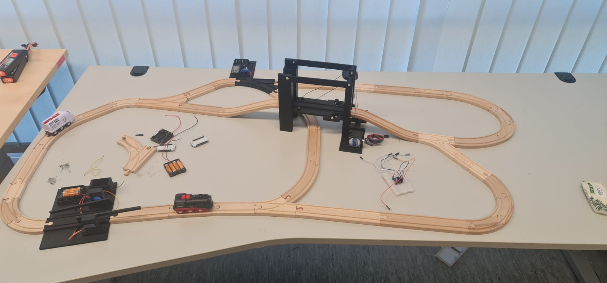
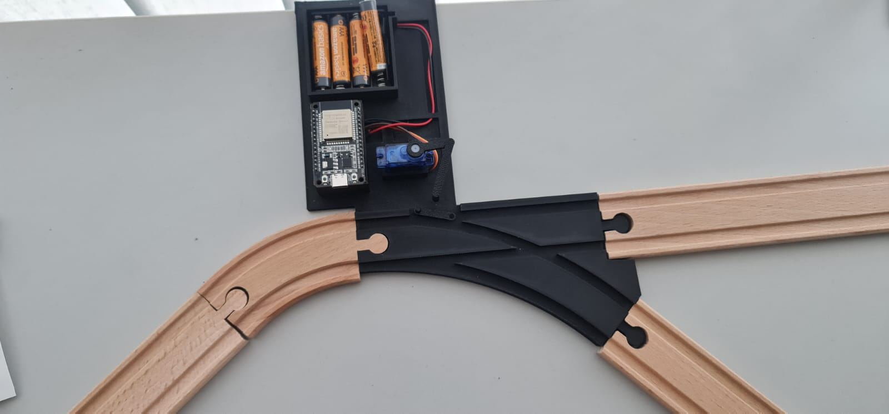
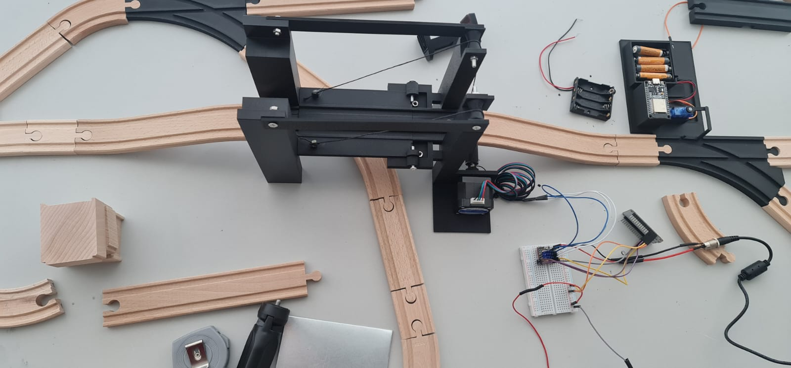
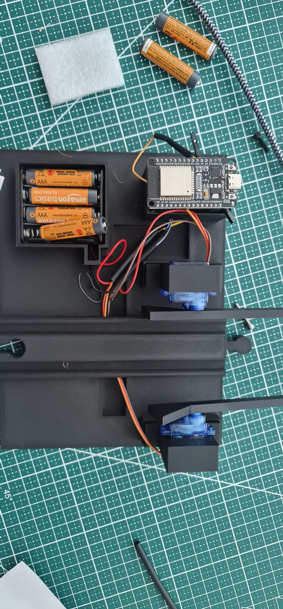
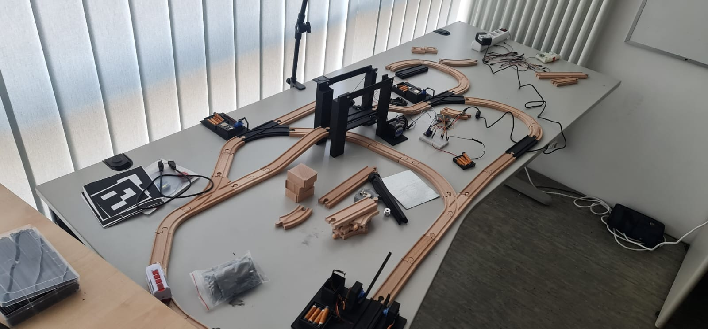

# ESP32 Brio Train Automation

A scalable, wireless control system for a wooden Brio train layout, built with ESP32
boards and the MQTT messaging protocol. Each actuator on the layout (the trains, a
lift bridge, track switches, and level-crossing barriers) is its own ESP32 node. All
nodes connect over WiFi to a central laptop, which runs an MQTT broker and a Python
control panel.

This is part of a research assistant project at the Chair of Intelligent Automation
Systems, TU Clausthal (supervisor: Prof. Dr.-Ing. habil. Stefan Palis). The goal is a
computer-controlled train network that can grow by adding more trains, track elements,
and sensors.



## How it works

The system uses a publish and subscribe model (MQTT). It works like a radio station:

1. The laptop runs an MQTT broker (Mosquitto). The broker is the central post office.
2. Each ESP32 connects to the same WiFi and to the broker.
3. Each ESP32 subscribes to one topic, for example `bridge/1`.
4. The Python control panel publishes a message to that topic, for example `up`. The
   broker delivers it only to the matching ESP32, which then moves a motor or servo.

```
  Python control panel  --->  MQTT broker (laptop)  --->  ESP32 nodes  --->  motors / servos
        publish                  routes by topic              subscribe
```

### Why this scales

Every node only needs to know its own topic, not the other nodes. The same firmware is
reused for many nodes: the only difference is the MQTT topic. For example, one diversion
program runs on both switch nodes, with `diversion/1` on one board and `diversion/2` on
the other. New trains, switches, or sensors can be added without changing the existing
code.

## Nodes

| Node              | Count            | MQTT topic            | Actuator                      | Status        |
|-------------------|------------------|-----------------------|-------------------------------|---------------|
| Train             | 2 (black, white) | `train/1`, `train/2`  | DC motor via L9110S H-bridge  | working       |
| Lift bridge       | 1                | `bridge/1`            | Stepper motor + driver        | working       |
| Diversion switch  | 2                | `diversion/1`, `diversion/2` | Servo                  | working       |
| Crossing barrier  | 2                | `barrier/1`, `barrier/2`     | Two servos              | working       |
| Position sensors  | planned          | publishes to module topics   | IR sensors (before/after each module) | in progress |
| Computer vision   | planned          | (laptop side)         | Overhead camera               | in progress   |

The five 3D printed actuator modules (1 bridge, 2 diversions, 2 barriers) each use one
ESP32, plus one ESP32 inside each train. The plan is to add IR sensors before and after
each module so the system knows train positions and can prevent collisions. The final
number of sensor nodes is not fixed yet.

## MQTT commands

| Topic         | Accepted messages                          |
|---------------|--------------------------------------------|
| `train/N`     | `forward`, `backward`, `stop`, `speed:NNN` |
| `bridge/1`    | `up`, `down`                               |
| `diversion/N` | `straight`, `right`                        |
| `barrier/N`   | `open`, `close`                            |

The IR sensor node publishes `close` and `open` to a barrier topic automatically when a
train passes, so a barrier can react without the laptop.

## Repository layout

```
esp32-train-automation/
├── firmware/              ESP32 code, one folder per node type (Arduino requirement)
│   ├── train_motor/       flashed once per train, change the topic to train/1 or train/2
│   ├── bridge/
│   ├── diversion/         flashed twice, topic set to diversion/1 or diversion/2
│   ├── barrier/           flashed twice, topic set to barrier/1 or barrier/2
│   └── ir_sensor/         position sensing (work in progress)
├── controller/
│   └── train_control_gui.py   desktop control panel for the laptop
└── docs/
    ├── wiring_diagram.png
    └── images/                photos of the modules and full layout
```

## Setup

### 1. Set your network details in the code

Every firmware file has three lines near the top. Replace the placeholders with your
own values before uploading:

```cpp
const char* ssid        = "YOUR_WIFI_NAME";
const char* password    = "YOUR_WIFI_PASSWORD";
const char* mqtt_broker  = "YOUR_LAPTOP_IP";
```

In the control panel, set the same `YOUR_LAPTOP_IP` near the top of
`controller/train_control_gui.py`.

`YOUR_LAPTOP_IP` is the IP address of the laptop running the broker, on the same network
as the ESP32 boards. On Windows find it with `ipconfig`, on Linux with `hostname -I`.
Note: if you use a phone hotspot, this IP can change each time you reconnect.

### 2. Flash the ESP32 boards

Open each folder in the Arduino IDE and upload it to the matching board. For nodes that
exist more than once (trains, diversions, barriers), change the MQTT topic in the code
before flashing the second board.
Required libraries: `WiFi`, `PubSubClient`, and `ESP32Servo` (for servo nodes).

### 3. Run the broker on the laptop

Install and start [Mosquitto](https://mosquitto.org/), listening on port 1883.

### 4. Run the control panel

```bash
pip install paho-mqtt
python controller/train_control_gui.py
```

A window opens with buttons for each module and a speed control for the train. The
control panel already uses the paho-mqtt version 2 API (`CallbackAPIVersion.VERSION1`).

## Modules

| Diversion switch | Lift bridge | Crossing barrier |
|------------------|-------------|------------------|
|  |  |  |

## Work in progress

- Position sensing: IR sensors before and after each module, to track trains and avoid
  collisions on a growing network.
- Computer vision: an overhead camera to detect train positions on the whole layout.
  ArUco markers are being tested for this (visible on the table below).


